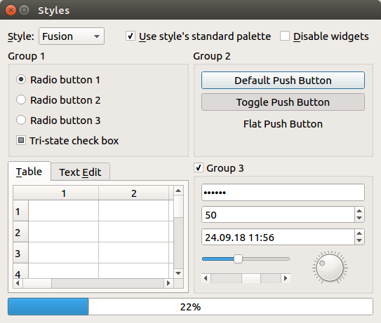

# PyQt Widgets

This sample application shows the most common PyQt widgets:

The source code is in [`main.py`](main.py). For instructions how to run it, please see [here](/1mh/pyqt-examples#running-the-examples).
