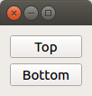

# QVBoxLayout PyQt5

Layouts let you position GUI elements next to each other. [`QVBoxLayout`](https://doc.qt.io/qt-5/qvboxlayout.html) arranges items vertically:

The related [`QHBoxLayout`](https://doc.qt.io/qt-5/qhboxlayout.html) positions items horizontally. For an even more powerful approach, see [`QGridLayout`](https://doc.qt.io/qt-5/qgridlayout.html).

The source code for this example is in [`main.py`](main.py). For instructions how to run it, please see [here](https://github.com/1mh/pyqt-examples#running-the-examples).