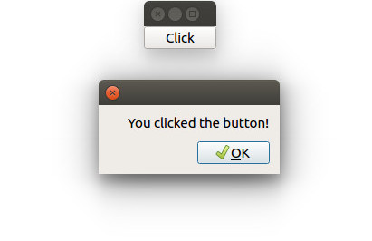

# PyQt Signals and Slots

Signals let you react to user input such as mouse clicks. A *slot* is a function that gets called when such an event occurs. The file [`main.py`](main.py) in this directory shows this in action: When the user clicks a button, a popup appears:

For instructions how to run this sample, please see [here](https://github.com/1mh/pyqt-examples#running-the-examples).
