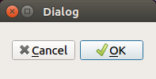

# Qt Designer python

[Qt Designer](https://build-system.fman.io/qt-designer-download) is a graphical tool for editing Qt GUIs. It produces `.ui` files. This is a special XML format for storing layouts. The dialog in the following screenshot comes from [`dialog.ui`](dialog.ui):

For instructions how to run this sample, please see [here](https://github.com/1mh/pyqt-examples#running-the-examples).