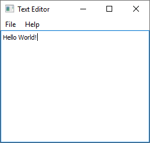
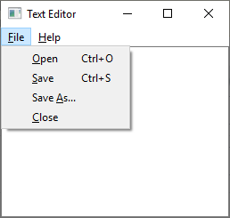
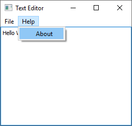
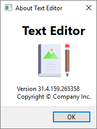
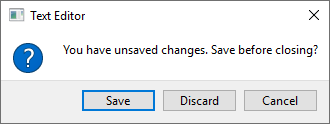

# Qt Text Editor

This example implements a simple text editor with (Py)Qt.

 

 

It has a surprising number of features:

 * A *File* menu for opening and saving files.
 * Keyboard shortcuts.
 * An *About* dialog (shown above).
 * A warning *Do you want to quit before saving?* if there are unmodified changes.

The source code of the text editor is in [`main.py`](main.py). For instructions on how to run it, please see [here](https://github.com/1mh/pyqt-examples#running-the-examples).
