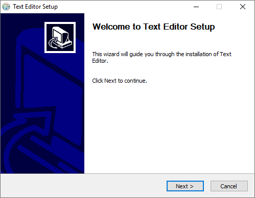
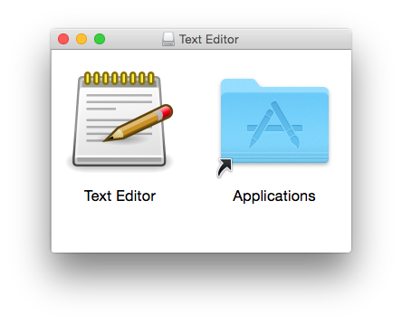

# PyQt5 exe

Once you have a PyQt5 application, you want to compile your Python source code into a standalone executable. Furthermore, you normally want to create an installer so your users can easily set up your app.

This example uses [fbs](https://build-system.fman.io) to create a standalone executable and an installer for the text editor in [example 07](../07%20Qt%20Text%20Editor).

 

To run this example, you need fbs installed as per the instructions [here](https://github.com/1mh/pyqt-examples#running-the-examples). Then, you can do:

    fbs run

to run the sample application. The following command then produces a standalone executable:

    fbs freeze

Finally, the following creates an installer that you can distribute to other people:

    fbs installer

Please note that this last command requires that you have [NSIS](https://nsis.sourceforge.io/Main_Page) installed and on your `PATH` on Windows, or [`fpm`](https://github.com/jordansissel/fpm) on Linux.