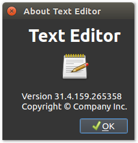

# Qt Dark Theme

This example shows how Qt's style mechanisms can be used to set a dark theme. It adapts the text editor from [example 7](../07%20Qt%20Text%20Editor).

As you can see in [`main.py`](main.py), this example uses `QApplication.setStyle(...)` and a `QPalette` to change the application's colors.

To run this example, please follow the [instructions in the main README](https://github.com/1mh/pyqt-examples#running-the-examples).