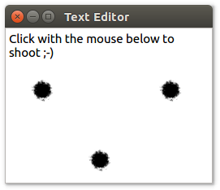

# QPainter Python example

This example application demonstrates how you can use [`QPainter`](https://doc.qt.io/qt-5/qpainter.html) to perform custom rendering in a widget. It turns the text editor from [example 7](../07%20Qt%20Text%20Editor) into an action shooter: When you click inside the editor with the mouse, bullet holes appear.

The crucial steps of this example are to override `mousePressEvent(...)` to handle the user's clicks, and `paintEvent(...)` to draw the bullets. See the top of [`main.py`](main.py) for how these features work in detail.

To run this example, please follow [these instructions](https://github.com/1mh/pyqt-examples#running-the-examples).