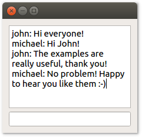

# PyQt Thread example

This example shows how you can use threads to make your PyQt application more responsive. It's a simple (but working!) chat client.

To run this example, please follow [the instructions in the README of this repository](https://github.com/1mh/pyqt-examples#running-the-examples). Instead of `python main.py`, use `python` to execute one of the scripts described below. Eg. `python 01_single_threaded.py`.

To demonstrate the utility of threads, this directory contains multiple implementations of the chat client:

 * [`01_single_threaded.py`](01_single_threaded.py) does not use threads. Once per second, it fetches the latest messages from the server. It does this in the main thread. While fetching messages, it's unable to process your key strokes. As a result, it sometimes lags a little as you type.
 * [`02_multithreaded.py`](02_multithreaded.py) uses threads to fetch new messages in the background. It is considerably more responsive than the single threaded version.
 * [`03_with_threadutil.py`](03_with_threadutil.py) is a variation of the multithreaded version. It extracts the logic necessary for communicating between threads into a separate module that you can use in your own apps, [`threadutil.py`](threadutil.py). For an even more powerful implementation, see [`threadutil_blocking.py`](threadutil_blocking.py). This is the code which [fman](https://fman.io) uses.
