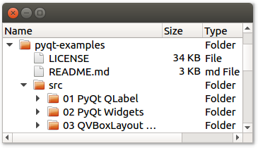

# QTreeView example in Python

A _tree view_ is what's classicaly used to display files and folders: A hierarchical structure where items can be expanded. This example shows a tree view of your local files.

To run the example, please follow [the instructions in the README of this repository](https://github.com/1mh/pyqt-examples#running-the-examples).

The data shown it the tree view comes from [`QDirModel`](https://doc.qt.io/qt-5/qdirmodel.html). This comes from Qt's [Model/View framework](https://doc.qt.io/qt-5/model-view-programming.html). The nice thing about it is that you can visualize the same data in different ways. The next example, [PyQt5 QListview](../13%20PyQt5%20QListView), shows how your files can be displayed in a list instead of a tree.