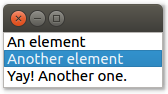

# PyQt5 QListView

This example shows how you can use a PyQt5 [`QListView`](https://doc.qt.io/qt-5/qlistview.html) to display a list.

It simply shows a static list of strings. Technically, the data is managed by Qt's [`QStringListModel`](https://doc.qt.io/qt-5/qstringlistmodel.html). But thanks to the generality of Qt's Model/View framework, you can also use QListView to display other data. For instance, you might want to try connecting it to the `QDirModel` from [example 12](../12%20QTreeView%20example%20in%20Python).

To run this example, please follow [the instructions in the README of this repository](https://github.com/1mh/pyqt-examples#running-the-examples).
