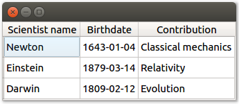

# QAbstractTableModel example

This [`QAbstractTableModel`](https://doc.qt.io/qt-5/qabstracttablemodel.html) example shows how you can define a custom Qt _model_ to display tabular data.

The code, which you can find in [`main.py`](main.py), implements all required methods for defining a custom table: `rowCount(...)`, `columnCount(...)`, etc. The resulting application displays a table of famous scientists.

To run this example application, please follow [the instructions in the README of this repository](https://github.com/1mh/pyqt-examples#running-the-examples).
