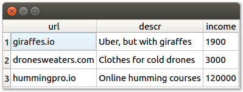

# PyQt database example

This example shows how you can connect to a database from a PyQt application. 

The screenshot shows a table of project data that comes from a SQL database. One of the projects is real ;-)

To run this example, first follow [these instructions](https://github.com/1mh/pyqt-examples#running-the-examples). Then run `python initdb.py` to initialize the database. After that, you can run `python main.py` to start the sample application.

The database used here is SQLite for simplicity. But you can easily user other databases as well, for instance PostgreSQL via the [psycopg2](http://initd.org/psycopg/) library.
